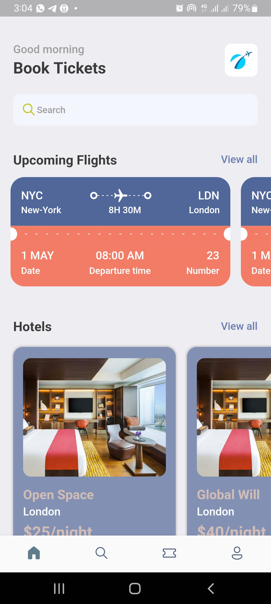
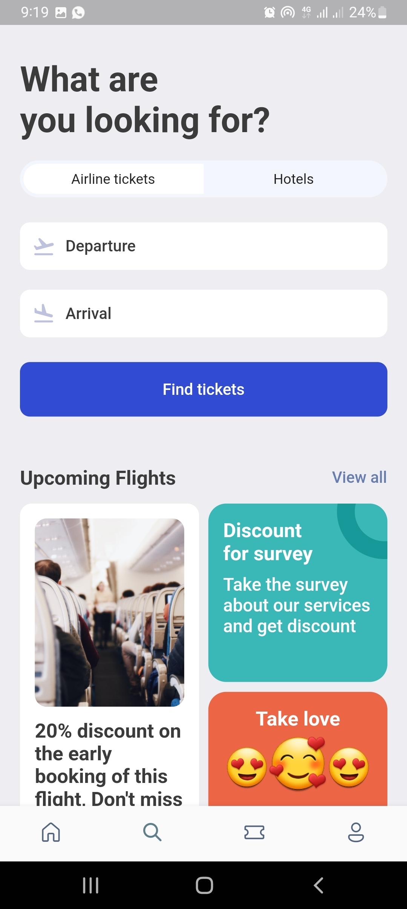
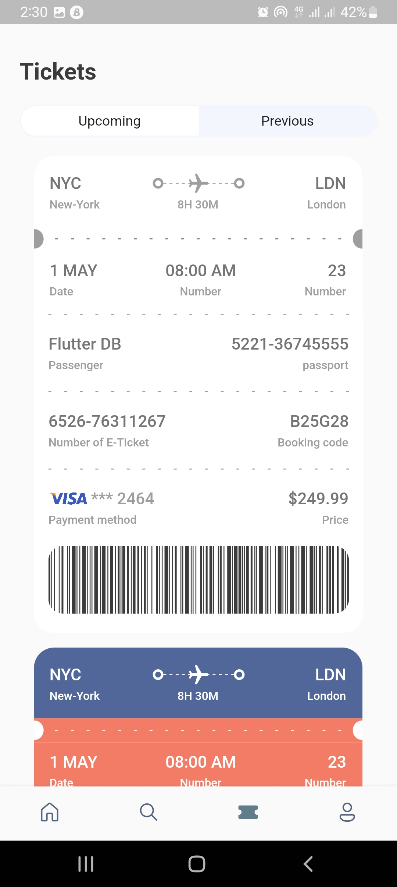
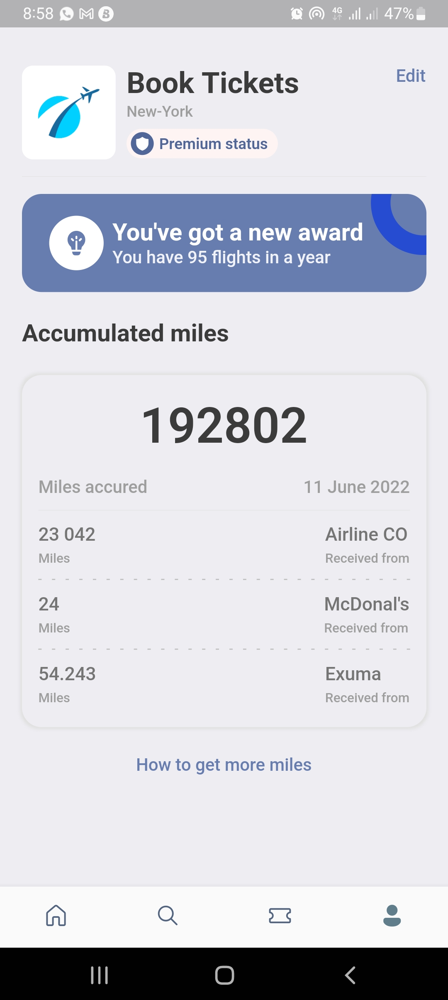

# booktickets

A new Flutter project.

## Getting Started

This project is a starting point for a Flutter application.

A few resources to get you started if this is your first Flutter project:

- [Lab: Write your first Flutter app](https://flutter.dev/docs/get-started/codelab)

## Screenshots

## Libraries

These are some of the libraries used on `pubspec.yaml`:
- fluentui_icons - [link](https://pub.dev/packages/fluentui_icons)
- get - [link](https://pub.dev/packages/get)
- gap - [link](https://pub.dev/packages/gap)
- barcode_widget - [link](https://pub.dev/packages/barcode_widget)